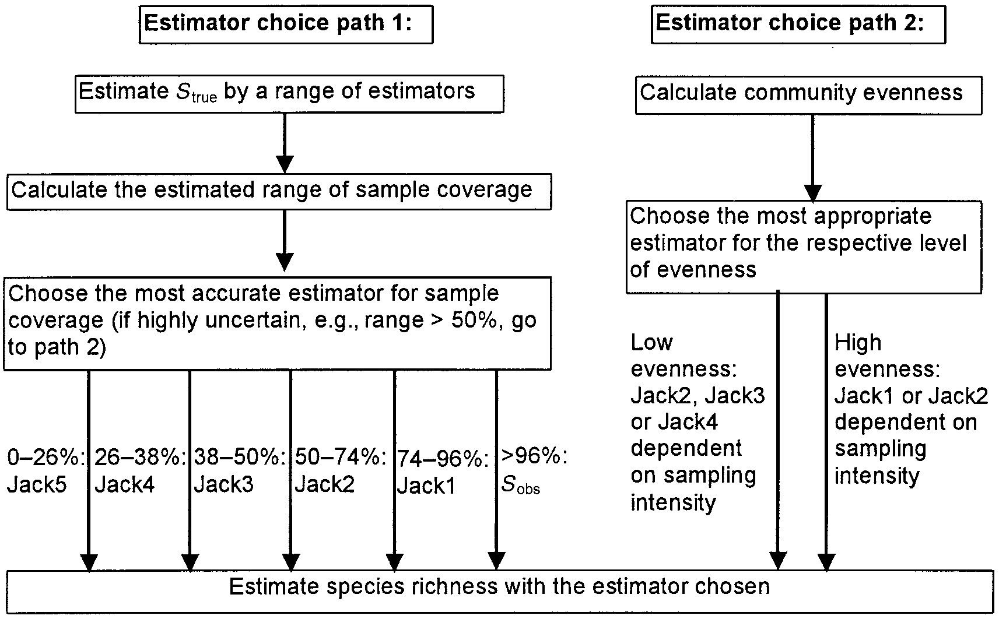
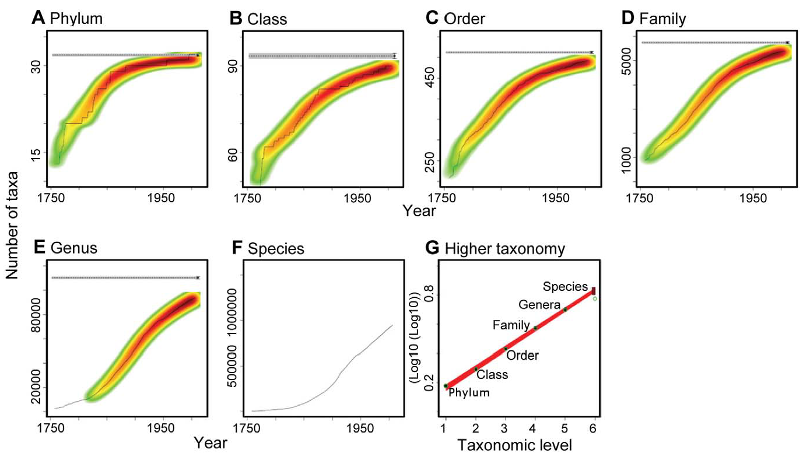

# (PART) Diversité neutre d’une communauté {-}

# Mesures neutres de la diversité $\alpha$ ou $\gamma$ {#chap-MesuresNeutres}

```{r}
#| label: MesuresNeutres
#| include: false
library("tidyverse")
library("gridExtra")
```


::: {.Summary data-latex=""}
Les indices classiques de diversité sont ceux de Shannon et de Simpson, et la richesse spécifique.
Ils peuvent être estimés à partir des données d'inventaire.
L'estimation de la richesse est particulièrement difficile et fait l'objet d'une abondante littérature: les estimateurs non-paramétriques (Chao et Jackknife) sont les plus utilisés.
:::

Les mesures classiques [@Peet1974] considèrent que chaque classe d'objets est différente de toutes les autres, sans que certaines soient plus ou moins semblables. 
Dans ce chapitre, les classes seront des espèces. 
Les mesures sont qualifiées de neutres (*species-neutral*) au sens où elles ne prennent en compte aucune caractéristique propre des espèces.
La diversité neutre est souvent appelée diversité taxonomique [@Devictor2010; @Stegen2011], même si le terme peut prêter à confusion avec la diversité phylogénétique, quand la phylogénie se réduit à une taxonomie [@Clarke2001; @Ricotta2003c].

Ce type de mesure n'a de sens qu'à l'intérieur d'un taxocène bien défini: sommer un nombre d'espèces d'insectes à un nombre d'espèces de mammifères a peu d'intérêt.
Ces méthodes ne sont donc pas forcément les plus adaptées à la conservation: à grande échelle, des indicateurs de biodiversité [@Balmford2003] peuvent être plus pertinents. 
D'autre part, les communautés sont considérées comme limitées, avec un nombre d'espèces fini: la courbe d'accumulation des espèces atteint donc théoriquement une asymptote quand l'effort d'inventaire est suffisant.
Cette approche est opposée à celle, traitée dans les chapitres \@ref(chap-Fisher) et suivants, qui considère que la diversité augmente indéfiniment avec la surface [@Williamson2001], que ce soit par changement d'échelle (élargir l'inventaire ajoute de nouvelles communautés) ou, plus théoriquement, parce que les communautés réelles sont considérées comme un tirage aléatoire parmi une infinités d'espèces [@Fisher1943].

Les mesures présentées ici sont les plus utilisées: richesse, indices de Shannon et de Simpson, et l'indice de Hurlbert. 
Elles sont sujettes à des biais d'estimation [@Mouillot1999], notamment (mais pas seulement) à cause des espèces non échantillonnées.

Au chapitre suivant, l'entropie HCDT permettra d'unifier ces mesures et les nombres de Hill, et de leur donner un sens intuitif.


## Richesse spécifique {#sec-Richesse}

La richesse est tout simplement le nombre d'espèces présentes dans le taxocène considéré.
C'est la mesure conceptuellement la plus simple mais pratiquement la plus délicate dans des systèmes très riches comme les forêts tropicales: même avec des efforts d'inventaire considérables, il n'est en général pas possible de relever toutes les espèces rares, ce qui implique de recourir à des modèles mathématiques pour en estimer le nombre.

On ne fait pas de supposition sur la forme de la SAD (voir section \@ref(sec-SAD)) quand on utilise des méthodes d'estimation non paramétriques. 
Les estimateurs les plus connus sont ceux de @Chao1984 et le *jackknife* [@Burnham1979].

Une alternative consiste à inférer à partir des données les paramètres d'une SAD choisie, et particulièrement le nombre total d'espèces. 
Cette approche est bien moins répandue parce qu'elle suppose le bon choix du modèle et est beaucoup plus intensive en calcul.
Il n'existe pas de meilleur estimateur universel [@OHara2005] et il peut être efficace d'utiliser plusieurs méthodes d'estimation de façon concurrente sur les mêmes données [@Basset2012].


### Techniques d'estimation non paramétrique

Dans le cadre d'un échantillonnage de $n$ individus, on observe $f_{>0}$ espèces différentes parmi les $S$ existantes. 
Chaque individu a une probabilité $p_s$ d'appartenir à l'espèce $s$.

On ne sait rien sur la loi des $p_s$. 
On sait seulement, comme les individus sont tirés indépendamment les uns des autres, que l'espérance du nombre $n_s$ d'individus de l'espèce $s$ observé dans l'échantillon est $np_s$. 
La probabilité de ne pas observer l'espèce est $(1-p_s)^n$.

Pour les espèces fréquentes, $np_s$ est grand, et les espèces sont observées systématiquement. 
La difficulté est due aux espèces pour lesquelles $np_s$, l'espérance du nombre d'observations, est petit. 
La probabilité de les observer est donnée par la loi binomiale: si $np_s$ est proche de 0, la probabilité d'observer un individu est faible.

Les estimateurs non paramétriques cherchent à tirer le maximum d'information de la distribution des abondances $n_s$ pour estimer le nombre d'espèces non observées. 
Une présentation détaillée du problème et des limites à sa résolution est fournie par @Mao2005 qui concluent notamment que les estimateurs ne peuvent fournir qu'une borne inférieure de l'intervalle des possibles valeurs du nombre réel d'espèces.


#### Chao1 et Chao2

@Chao1984 estime le nombre d'espèces non observées à partir de celles observées 1 ou 2 fois.

Dans un échantillon de taille $n$ résultant d'un tirage indépendant des individus, la probabilité que l'espèce $s$ soit observée $\nu$ fois est obtenue en écrivant la probabilité de tirer dans l'ordre $\nu$ fois l'espèce $s$ puis $n-\nu$ fois une autre espèce, multiplié par le nombre de combinaisons possible pour prendre en compte l'ordre des tirages:
\begin{equation}
  (\#eq:psnu)
  p_{s, \nu}(n) = \binom{n}{\nu} {p_s^\nu \left( 1 - p_s \right)^{n - \nu}}.
\end{equation}


L'espérance du nombre d'espèces observées $\nu$ fois, ${\mathbb E}(f_{\nu})$, est obtenue en sommant pour toutes les espèces la probabilité de les observer $\nu$ fois:
\begin{equation}
  (\#eq:Esnnu)
  {\mathbb E}\left( f_{\nu} \right) = \binom{n}{\nu} \sum_s{p_s^\nu \left( 1 - p_s \right)^{n - \nu}}.
\end{equation}

Le carré de la norme du vecteur en $S$ dimensions dont les coordonnées sont $(1 - p_s)^{n / 2}$ est 
$$\sum_s{(1 - p_s)^n},$$
c'est-à-dire ${\mathbb E}(f_{0})$, l'espérance du nombre d'espèces non observées.
Celui du vecteur de coordonnées $p_s (1 - p_s)^{n / 2 - 1}$ est 
$$\sum_s{p_s^2 (1 - p_s)^{n - 2}} = \frac{2}{n (n - 1)}{\mathbb E}(f_{2}).$$
Enfin, le produit scalaire des deux vecteurs vaut 
$$\sum_s{p_s (1 - p_s)^{n - 1}} = \frac{1}{n}{\mathbb E}(f_{1}).$$
  

L'inégalité de Cauchy-Schwarz (le produit scalaire est inférieur au produit des normes des vecteurs) peut être appliquée aux deux vecteurs (tous les termes sont au carré):
\begin{equation}
  (\#eq:CauchySchwarz)
  \left[ \sum_s{(1 - p_s)^n} \right] \left[ \sum_s{p_s^2 (1 - p_s)^{n-2}} \right] 
   \ge \left[ \sum_s{p_s (1 - p_s)^{n-1}} \right]^2,
\end{equation}


d'où
\begin{equation}
  (\#eq:Esn0)
  {\mathbb E}(f_{0}) 
  \ge \frac{n - 1}{n}\frac{\left[ {\mathbb E}(f_{1}) \right]^2}{2 {\mathbb E}(f_{2})}.
\end{equation}


L'estimateur est obtenu en remplaçant les espérances par les valeurs observées:

\begin{equation}
  (\#eq:Chao1)
  {\hat{S}}_\mathit{Chao1} 
   = f_{>0} + \frac{\left(n - 1 \right){\left( f_{1} \right)}^2}{2n {f_{2}}},
\end{equation}

où $f_{>0}$ est le nombre d'espèces différentes observé.

Il s'agit d'un estimateur minimum: l'espérance du nombre d'espèces est supérieure ou égale au nombre estimé.

@Beguinot2014 a montré que l'estimateur est sans biais si le nombre d'espèces non observées décroît exponentiellement avec la taille de l'échantillon:
\begin{equation}
  (\#eq:BiaisChao)
  f_{0} = S e^{-kn},
\end{equation}
où $k$ est un réel strictement positif.
Cette relation est cohérente avec un échantillonnage poissonien dans lequel la densité des individus est constante: voir le chapitre \@ref(chap-Accumulation).

Si aucune espèce n'est observée deux fois, l'estimateur est remplacé par
\begin{equation}
  (\#eq:Chao1sansf2)
  {\hat{S}}_\mathit{Chao1} = f_{>0} + \frac{\left( n - 1 \right){f_{1}}\left( f_{1} - 1 \right)}{2n}.
\end{equation}

Si $n$ n'est pas trop petit, les approximations suivantes sont possibles:

\begin{equation}
  (\#eq:Chao1sansn)
  \hat{S}_\mathit{Chao1}
   = {f_{>0}} + \frac{{\left( f_{1} \right)}^2}{2f_{2}}.
\end{equation}

Si aucune espèce n'est observée deux fois, l'estimateur est remplacé [@Chao2004] par

\begin{equation}
  (\#eq:Chao1sansnf2)
  {\hat{S}}_\mathit{Chao1} 
  = {f_{>0}} + {f_{1}\left( f_{1} - 1 \right)} / {2}.
\end{equation}


La variance de l'estimateur est connue, mais pas sa distribution:

\begin{equation}
  (\#eq:VarChao1)
  \operatorname{Var}{\left( {\hat{S}}_\mathit{Chao1} \right)} 
  = {f_{2}}\left[ 
      \frac{1}{2}{\left( \frac{f_{1}}{f_{2}} \right)}^2 
      + {\left( \frac{f_{1}}{f_{2}} \right)}^3 
      + \frac{1}{4}{\left( \frac{f_{1}}{f_{2}} \right)}^4
    \right].
\end{equation}

Si aucune espèce n'est observée deux fois:

\begin{equation}
  (\#eq:VarChao1sansf2)
  \operatorname{Var}{\left( {\hat{S}}_\mathit{Chao1} \right)}
  = \frac{f_{1}\left(f_{1}-1\right)}{2}
    + \frac{f_{1}{\left( 2f_{1} -1 \right)}^2}{4}
    + \frac{{\left( f_{1} \right)}^4}{4f_{>0}}.
\end{equation}

@Chao1987 donne une approximation de l'intervalle de confiance à 95\% en assumant une distribution normale: 

\begin{equation}
  (\#eq:ICChao1)
  f_{>0} + \frac{{\hat{S}}_\mathit{Chao1} - {f_{>0}}}{c}
  \le S
  \le {f_{>0}} + \left( {\hat{S}}_\mathit{Chao1} - {f_{>0}} \right)c,
\end{equation}

où

\begin{equation}
  (\#eq:ICChao1c)
  c = e^{
    t^{n}_{1 - \alpha / 2} \sqrt{
      \ln\left( 1 + \frac{\operatorname{Var}\left( {\hat{S}}_\mathit{Chao1} \right)}{{\left( {\hat{S}}_\mathit{Chao1} - {f_{>0}} \right)}^2} \right)
    }
  }.
\end{equation}

@Eren2012 [eq. 8] calculent un intervalle de confiance qui est plus petit quand la valeur maximum théorique du nombre d'espèces est connue, ce qui est rarement le cas en écologie.

@Chao1987 propose un estimateur du nombre d'espèces appliqué aux données de présence-absence (un certain nombre de relevés contiennent seulement l'information de présence ou absence de chaque espèce), appelé Chao2. Il est identique à Chao1 mais $n$ est le nombre de relevés, en général trop petit pour appliquer l'approximation de Chao1.

@Chiu2014a améliorent l'estimateur en reprenant la démarche originale de Chao mais en utilisant un estimateur plus précis du taux de couverture, \@ref(eq:CChao) au lieu de \@ref(eq:CGood):

\begin{equation}
  (\#eq:iChao1)
  {\hat{S}}_\mathit{iChao1} 
  = {\hat{S}}_\mathit{Chao1} 
    + \frac{f_{3}}{4f_{4}}
    \,\max\left( f_{1} - \frac{f_{2}f_{3}}{2f_{4}} ; 0 \right).
\end{equation}

@Chao2017 étendent l'applicabilité de l'estimateur Chao2 à des données dans lesquelles les espèces sont notées uniquement comme singletons ou doubletons et plus, sans distinction entre doubletons et espèces plus fréquentes.
Une relation entre le nombre de doubletons et les données disponibles est fournie; sa résolution numérique (le code R nécessaire est disponible avec l'article) permet d'estimer $f_{2}$ et de l'injecter dans l'estimateur Chao2.


#### L'estimateur ACE

@Chao1992 développent l'estimateur ACE (*Abundance-based coverage estimator*) à travers l'estimation du taux de couverture $C$. 
L'estimateur ACE utilise toutes les valeurs de $f_\nu$ correspondant aux espèces rares: concrètement, la valeur limite de $\nu$ notée $\kappa$ est fixée arbitrairement, généralement à 10.

L'estimateur prend en compte le coefficient de variation de la distribution des fréquences (${\hat{p}}_s$): plus les probabilités sont hétérogènes, plus le nombre d'espèces non observées sera grand. 
Finalement:

\begin{equation}
  (\#eq:ACE)
  \hat{S}_{\mathit{ACE}} 
  = f_{>\kappa} + \frac{f_{\le\kappa}}{\hat{C}_\mathit{rare}} + \frac{f_{1}}{{\hat{C}}_\mathit{rare}}{\hat{\gamma}}_\mathit{rare}.
\end{equation}

$f_{>\kappa}$ est le nombre d'espèces dites abondantes, observées plus de $\kappa$ fois, $f_{\le\kappa}$ le nombre d'espèces dites rares, observées $\kappa$ fois ou moins. 
$\hat{C}_\mathit{rare}$ est le taux de couverture ne prenant en compte que les espèces rares.

L'estimateur du coefficient de variation au carré est

\begin{equation}
  (\#eq:ACEcv)
  \hat{\gamma}^{2}_\mathit{rare} 
  = \max\left( 
    \frac{
      f_{\le\kappa} \sum^{\kappa}_{\nu=1}{\nu\left( \nu - 1 \right){f_\nu}}
    }{
      \hat{C}_\mathit{rare} \left( \sum^{\kappa}_{\nu = 1}{\nu f_{\nu}} \right) \left( \sum^{\kappa}_{\nu = 1}{\nu f_{\nu}} - 1 \right)
    } - 1 ; 0
  \right).
\end{equation}

Lorsque l'hétérogénéité est très forte, un autre estimateur est plus performant:

\begin{equation}
  (\#eq:ACEcv2)
  \tilde{\gamma}^{2}_\mathit{rare} 
  = \max\left(
    {\hat{\gamma}}^2_\mathit{rare} \left( 
      1 + \frac{
        \left( 1 - {\hat{C}}_\mathit{rare} \right) \sum^{\kappa}_{\nu = 1}{\nu\left( \nu - 1 \right){f_\nu}}
      }{
        {\hat{C}}_\mathit{rare} \left( \sum^{\kappa}_{\nu = 1}{\nu f_\nu - 1} \right)
      }
    \right) ; 0 
  \right).
\end{equation}

@Chao2010a conseillent d'utiliser le deuxième estimateur dès que ${\hat{\gamma}}^2_\mathit{rare}$ dépasse 0,8. 
L'estimateur ACE donne normalement une valeur plus grande que Chao1. 
Si ce n'est pas le cas, la limite des espèces rares $\kappa$ doit être augmentée.


#### L'estimateur jackknife

La méthode jackknife a pour objectif de réduire le biais d'un estimateur en considérant des jeux de données dans lesquels on a supprimé un certain nombre d'observations (ce nombre est l'*ordre* de la méthode). 
Burnham et Overton [-@Burnham1978; -@Burnham1979] ont utilisé cette technique pour obtenir des estimateurs du nombre d'espèces, appelés jackknife à l'ordre $j$, prenant en compte les valeurs de $f_1$ à $f_j$. 
Les estimateurs du premier et du deuxième ordre sont les plus utilisés en pratique:

\begin{equation}
  (\#eq:Jack1)
  \hat{S}_\mathit{J1} = {f_{>0}} + \frac{\left( n - 1 \right) f_1}{n},
\end{equation}

\begin{equation} 
  (\#eq:Jack2)
  \hat{S}_\mathit{J2} 
  = {f_{>0}} + \frac{\left( 2n - 3 \right) f_1}{n} 
    - \frac{{\left( n - 2 \right)}^2 f_2}{n \left( n - 1 \right)}.
\end{equation}

\begin{equation} 
  (\#eq:Jack3)
  \hat{S}_\mathit{J3} 
  = {f_{>0}} + \frac{\left( 3n - 6 \right) f_1}{n} 
    - \frac{\left( 3n^2 - 15n +19 \right) f_2}{n \left( n - 1 \right)}
    + \frac{{\left( n - 3 \right)}^3 f_3}{n \left( n - 1 \right) \left( n - 2 \right)}.
\end{equation}

Augmenter l'ordre du jackknife diminue le biais mais augmente la variance de l'estimateur.

@Chao1984 a montré que les estimateurs jackknife pouvaient être retrouvés par approximation de l'indice Chao1.

La variance du jackknife d'ordre 1 est [@Heltshe1983]
\begin{equation} 
  (\#eq:VarJack1)
  \operatorname{Var}{\left( \hat{S}_\mathit{J1} \right)}
  = \frac{n - 1}{n} \left( \sum_{j = 1}^{n}{j^2 f_j} - \frac{f_{>0}^2}{n} \right).
\end{equation}

L'estimateur est construit à partir de l'hypothèse selon laquelle le nombre d'espèces non observées est de la forme
$$f_0(n) = \sum_{i = 1}^{\infty}{\frac{a_i}{n^i}},$$

où la notation $f_0(n)$ est utilisée pour expliciter sa dépendance à l'effort d'échantillonnage.

Pour cette raison, @Cormack1989 affirme qu'il n'a pas de support théorique solide.
L'espérance du nombre d'espèces non observées est (eq. \@ref(eq:Esnnu)) $\sum_s{(1 - p_s)^n}$, qui décroît beaucoup plus rapidement que $\sum_{i}{{a_i}/{n^i}}$: l'hypothèse est bien fausse.
En revanche, pour une gamme de $n$ fixée (de la taille de l'inventaire à une taille suffisante pour approcher la richesse asymptotique par exemple), il est toujours possible d'écrire le nombre d'espèces non observées sous la forme d'une série de puissances négatives de $n$, comme dans l'illustration ci-dessous.

Une communauté log-normale, similaire à BCI (300 espèces, écart-type égal à 2) est simulée et un échantillon de 1000 individus est tiré.

```{r}
#| label: BiaisJack1
# Ecart-type
sdlog <- 2
# Nombre d'espèces
S <- 300
# Tirage des probabilités log-normales
lnorm_abd <- rlnorm(S, 0, sdlog)
lnorm_prob <- lnorm_abd / sum(lnorm_abd)
# Taille de l'échantillon
n <- 1000
# Tirage d'un échantillon
library("divent")
abundances <- rcommunity(1, size = n, prob = lnorm_prob)
```

L'échantillon est présenté en figure \@ref(fig:BiaisJack1Fig).

Code de la figure \@ref(fig:BiaisJack1Fig):
```{r}
#| label: BiaisJack1Code
#| eval: false
autoplot(abundances, fit_rac = TRUE, distribution="lnorm")
```

```{r}
#| label: BiaisJack1Fig
#| echo: false
#| results: 'hide'
#| ref.label: 'BiaisJack1Code'
#| fig_cap: "Echantillon de 1000 individus tiré dans une communauté log-normale."
```


Il est possible de vérifier que l'espérance du nombre d'espèces non observées correspond bien à la moyenne des observations.

```{r}
#| label: BiaisJack2
# Espérance des espèces non vues
E0 <- (1 - lnorm_prob)^n
(f0 <- sum(E0))
# Tirage de 1000 échantillons, nombre moyen d'espèces observées
(s_obs <- mean(colSums(rmultinom(1000, size = n, prob = lnorm_prob) > 0)))
# Vérification: nombre d'espèces observées en moyenne et non observées
s_obs + f0
# Nombre total d'espèces dans la communauté
(S <- length(lnorm_prob))
```

Le nombre d'espèces non observées peut être écrit sous la forme d'une série de puissances négatives de $n$, comme le prévoit le jackknife, entre deux valeurs de $n$ fixées.

```{r}
#| label: BiaisJack3
# Echantillonnage de 500 à 5000 individus
n_seq <- 500:5000
# Calcul du nombre d'espèces non observées
bias <- sapply(n_seq, function(n) sum((1 - lnorm_prob)^n))
```

Le nombre d'espèces non observées, qui est le biais de l'estimateur de la richesse, est présenté en figure \@ref(fig:BiaisJack3Fig).

La courbe peut être approchée par une série de puissances négatives de $n$ dont quelques termes sont présentés sur la figure.

```{r}
#| label: BiaisJack4
# Ordre 1
lm1 <- lm(bias ~ 0 + I(1  /n_seq))
# Ordre 2
lm2 <- lm(bias ~ 0 + I(1 / n_seq) + I(1 / n_seq^2))
# Ordre 4
lm4 <- lm(
  bias ~ 0 + I(1 / n_seq) + I(1 / n_seq^2) + I(1 / n_seq^3) + I(1 / n_seq^4)
)
```

Les termes $a_i$ de la série de puissances négatives sont estimées par des modèles linéaires.
A l'ordre 1, le modèle *lm1* fournit une approximation grossière du nombre d'espèces non observées avec un seul terme ($f_0(n) \approx a_1 / n$).
Le modèle s'appproche de plus en plus des données en augmentant le nombre de terme.
Le modèle *lm4* contient 4 termes $a_1$ à $a_4$ :

```{r}
#| label: BiaisJack5
lm4$coefficients
```
A partir de 6 termes, les valeurs du biais d'estimation sont presque parfaitement estimées.

(ref:BiaisJack3Fig) Nombre d'espèces non observées dans un échantillon de taille croissante et sa décomposition en séries de puissances négatives de $n$. Le nombre d'espèces non observées est représenté par la courbe continue. Les séries de puissances négatives d'ordre 1, 2 et 4, notées *lm1* à *lm4*, sont représentées en pointillés. Les courbes d'ordre 6 et plus sont confondues avec la courbe noire.
```{r}
#| label: BiaisJack3Fig
#| echo: false
#| results: 'hide'
#| ref.label: 'BiaisJack3Code'
#| fig_cap: "(ref:BiaisJack3Fig)"
```

Code de la figure \@ref(fig:BiaisJack3Fig):
```{r}
#| label: BiaisJack3Code
#| eval: false
tibble(
  n = n_seq, 
  Biais = bias, 
  lm1 = predict(lm1),
  lm2 = predict(lm2), 
  lm4 = predict(lm4)
) %>% 
  pivot_longer(cols = -n) %>% 
  ggplot() +
    geom_line(aes(x = n, y = value, color = name, lty = name)) +
    coord_cartesian(ylim = c(0, 250)) +
    labs(
      color = "Nombre d'espèces", 
      lty = "Nombre d'espèces",
      y = "Nombre d'espèces"
    )
```

L'ajustement est possible pour des valeurs de $n$ différentes mais les coefficients $a_i$ sont alors différents: la forme du biais n'est valide que pour une gamme de valeurs de $n$ fixée.


@Beguinot2016 apporte un autre argument important en faveur du jackknife. 
À condition que $n$ soit suffisamment grand, l'estimateur du nombre d'espèces non observées est une fonction linéaire du nombre d'espèces observées $\nu$ fois: $f_1$ pour le jackknife 1, $2 f_1 - f_2$ pour le jackknife 2 et ainsi de suite pour les ordres suivants, contrairement à l'estimateur de Chao.
Grâce à cette propriété, l'estimateur du jackknife est additif quand plusieurs groupes d'espèces disjoints sont pris en compte: l'estimation du nombre d'espèces de papillons et de scarabées inventoriées ensemble est égale à la somme des estimations des deux groupes inventoriés séparément.
Ce n'est pas le cas pour l'estimateur de Chao.

L'estimateur du jackknife est très utilisé parce qu'il est efficace en pratique, notamment parce que son ordre peut être adapté aux données.


#### L'estimateur du bootstrap

L'estimateur du bootstrap [@Smith1984] est
\begin{equation} 
  (\#eq:Smith1984)
  \hat{S}_\mathit{b} = {f_{>0}} + \sum_s{(1 - p_s)^n}.
\end{equation}

Il est peu utilisé parce que le jackknife est plus performant [@Colwell1994]. 


#### Calcul

Ces estimateurs peuvent être calculés de façon relativement simple à l'aide du logiciel SPADE, dans sa version pour R [@Chao2016c].
Le guide de l'utilisateur présente quelques estimateurs supplémentaires et des directives pour choisir. 
Il est conseillé d'utiliser Chao1 pour une estimation minimale, et ACE pour une estimation moins biaisée de la richesse.

Les intervalles de confiance de chaque estimateur sont calculés par bootstrap: même quand la variance d'un estimateur est connue, sa loi ne l'est généralement pas, et le calcul analytique de l'intervalle de confiance n'est pas possible.

Les estimateurs et leurs intervalles de confiance peuvent également être calculés avec le package *vegan* qui dispose pour cela de deux fonctions: `specpool` et `estimateR`. 

`specpool` est basé sur les incidences des espèces dans un ensemble de sites d'observation et donne une estimation unique de la richesse selon les méthodes Chao2, jackknife (ordre 1 et 2) et bootstrap. 
L'écart-type de l'estimateur est également fourni par la fonction, sauf pour le jackknife d'ordre 2.

`estimateR` est basé sur les abondances des espèces et retourne un estimateur de la richesse spécifique par site et non global comme `specpool`.

#### Exemple

On utilise les données de Barro Colorado Island (BCI). 
La parcelle a été divisée en carrés de 1&nbsp;ha. 
Le tableau d'entrée est un `dataframe` contenant, pour chaque espèce d'arbres ($\mathit{DBH}\ge$ 10&nbsp;cm), ses effectifs par carré.

On charge le tableau de données:

```{r}
#| label: Richesse1
library("vegan")
data(BCI)
```

On utilise la fonction `estimateR` pour calculer la richesse des deux premiers carrés:

```{r}
#| label: Richesse2
estimateR(BCI[1:2,])
```

Le package *SPECIES* [@Wang2011] permet de calculer les estimateurs jackknife d'ordre supérieur à 2 et surtout choisit l'ordre qui fournit le meilleur compromis entre biais et variance.

Comparaison des fonctions sur l'ensemble du dispositif BCI ($f_{>0}=225$, $f_1=19$):

```{r}
#| label: Richesse3
specpool(BCI)
library("SPECIES")
# Distribution du nombre d'espèces (vecteur: 
# noms = nombre d'individus
# valeurs = nombres d'espèces ayant ce nombre d'individus)
bci_abd <- colSums(BCI)
# Mise au format requis (matrice:
# colonne 1 = nombre d'individus
# colonne 2 = nombres d'espèces ayant ce nombre d'individus)
# par la fonction abd_freq_count dans divent
jackknife(as.matrix(abd_freq_count(bci_abd)))
```

Comparaison avec la valeur de l'équation \@ref(eq:Jack1):

```{r}
#| label: VerifJack1
# Nombre d'espèces par effectif observé
bci_abd_freq_count <- tapply(bci_abd, bci_abd, length)
# Calcul direct de Jack1
sum(bci_abd_freq_count) + 
  bci_abd_freq_count[1] * (sum(bci_abd) - 1) / sum(bci_abd)
```

La valeur du jackknife 1 fournie par `specpool` est fausse. 
La fonction `jackknife` de *SPECIES* donne le bon résultat, avec un intervalle de confiance calculé en supposant que la distribution est normale ($\pm$ 1,96 écart-type au seuil de 95\%).

L'estimateur du bootstrap est calculable simplement:
```{r}
#| label: Richesse4
# Effectif total
bci_n <- sum(bci_abd)
# Probabilités
bci_prob <- bci_abd / bci_n
# Estimateur du bootstrap
length(bci_prob) + sum((1 - bci_prob)^bci_n)
```


#### Choix de l'estimateur {#sec-ChoixEstimateur}

Des tests empiriques poussés ont été menés par @Brose2003 pour permettre le choix du meilleur estimateur de la richesse en fonction de la complétude de l'échantillonnage $f_{>0}/{S}$. 
Les auteurs appellent cette proportion couverture (*coverage*). 
Le terme *completeness* a été proposé par @Beck2010 pour éviter la confusion avec le taux de couverture défini par Good (vu en section \@ref(sec-Couverture)). 
La complétude est inférieure à la couverture: toutes les espèces ont le même poids alors que les espèces manquantes sont plus rares et pénalisent moins le taux de couverture.

(ref:Brose2003) Arbre de décision du meilleur estimateur du nombre d'espèces.
```{r}
#| label: Brose2003
#| echo: false
#| fig_cap: "(ref:Brose2003)"

```

Dans tous les cas, les estimateurs jackknife sont les meilleurs. 
L'arbre de décision est en figure \@ref(fig:Brose2003) [@Brose2003, fig. 6]. 
Le choix dépend principalement de la complétude (*coverage* sur la figure). 
Une première estimation est nécessaire par plusieurs estimateurs. 
Si les résultats sont cohérents, choisir un estimateur jackknife d'ordre d'autant plus faible que la complétude est grande. 
Au-delà de 96\%, le nombre d'espèces observé est plus performant parce que les jackknifes surestiment $S$. 
S'ils sont incohérents (intervalle des estimations supérieur à 50\% de leur moyenne), le critère majeur est l'équitabilité (voir section \@ref(sec-Equitabilite)). 
Si elle est faible (de l'ordre de 0,5 à 0,6), les estimateurs jackknife 2 à 4 sont performants, l'ordre diminuant avec l'intensité d'échantillonnage (forte: 10\%, faible: 0,5\% de la communauté). 
Pour une forte équitabilité (0,8 à 0,9), on préférera jackknife 1 ou 2.

Pour BCI, le nombre d'espèces estimé par jackknife 1 est 244. 
La complétude est ${225}/{244} = 92\%$, dans le domaine de validité du jackknife 1 (74\% à 96\%) qui est donc le bon estimateur.

La parcelle 6 de Paracou nécessite l'estimateur jackknife 2:
```{r}
#| label: ParacouJack
library("divent")
div_richness(colSums(paracou_6_abd))
# Complétude
as.numeric(
  Richness(Paracou6, Correction = "None") / Richness(Paracou6, Correction = "Jackknife")
)
```

@Chiu2014a, à partir d'autres simulations, préfèrent l'utilisation de l'estimateur *iChao1*.
Quand l'échantillonnage est suffisant, les estimateurs de Chao ont l'avantage de posséder une base théorique solide et de fournir une borne inférieure du nombre d'espèces possible.
Dans ce cas, les estimations du jackknife d'ordre 1 sont cohérentes avec celles de Chao.
En revanche, quand l'échantillonnage est insuffisant, l'estimateur jackknife d'ordre supérieur à 1 permet de réduire le biais d'estimation, au prix d'une variance accrue [@Marcon2015a].

Enfin, Beguinot [-@Beguinot2015a; -@Beguinot2016] suggère d'utiliser en règle générale le jackknife 2 (mais ne traite pas les cas dans lesquels l'échantillonnage est trop faible pour justifier un ordre supérieur) tant que  le nombre de singletons est supérieur à $2-\sqrt(2) \approx 0,6$ fois le nombre de doubletons.
Le ratio des singletons sur les doubletons diminue quand l'échantillonnage approche de l'exhaustivité.
Quand le seuil de 0,6 est dépassé, la valeur de l'estimateur de Chao devient supérieur au jackknife 2 et doit être utilisé.
Ce seuil est cohérent avec les règles de @Brose2003.


#### Prédiction de la richesse d'un nouvel échantillon {#sec-Extrapol}

La prédiction du nombre d'espèces $\hat{S'}$ découvert dans une nouvelle placette d'un habitat dans lequel on a déjà échantillonné est une question importante, par exemple pour évaluer le nombre d'espèces préservées dans le cadre d'une mise en réserve, ou évaluer le nombre d'espèces perdues en réduisant la surface d'une forêt.

@Shen2003 proposent un estimateur et le confrontent avec succès à des estimateurs antérieurs. 
On note $\hat{f_0}(n)$ l'estimateur du nombre d'espèces non observées dans le premier échantillon, et $\hat{C}$ l'estimateur de son taux de couverture. 
L'estimateur du nombre d'espèces du nouvel échantillon de $n'$ individus est

\begin{equation}
  \hat{S'} 
  = \hat{f_0}(n) \left[ 
    1 - {\left( 1 - \frac{1 - \hat{C}}{\hat{f_0}(n)} \right)}^{n'} 
  \right].
\end{equation}

$\hat{f_0}(n)$ est obtenu par la différence entre les nombres d'espèces estimé et observé: $\hat{f_0}(n) = \hat{S} - f_{>0}(n)$.

Exemple de BCI, suite: combien de nouvelles espèces seront découvertes en échantillonnant plus?

```{r}
#| label: NonObserve
# Espèces non observées
bci_abd %>% 
  div_richness() %>% 
  pull(diversity) %>% 
  `-`(length(BCI_abd)) %>% 
  print() ->
  bci_f_0
# Taux de couverture
bci_abd %>% 
  coverage %>% 
  pull(coverage) %>% 
  print -> 
  bci_C
```


(ref:NonObsNFig) Nombre de nouvelles espèces découvertes en fonction de l'effort d'échantillonnage supplémentaire (données de BCI). Seulement 7 nouvelles espèces seront observées en échantillonnant 10000 arbres supplémentaires (environ 25 ha en plus des 50 ha de la parcelle qui contiennent 225 espèces).
```{r}
#| label: NonObsNFig
#| echo: false
#| results: 'hide'
#| ref.label: 'NonObsNCode'
#| fig_cap: "(ref:NonObsNFig)"
```

Le taux de couverture de l'inventaire de BCI est très proche de 100\%, donc peu de nouvelles espèces seront découvertes en augmentant l'effort d'échantillonnage. 
La courbe obtenue est en figure \@ref(fig:NonObsNFig).

Le code R nécessaire pour réaliser la figure est:
```{r}
#| label: NonObsNCode
#| eval: false
# Nouvelles espèces en fonction du nombre de nouveaux individus
S_prime <- function(n_prime, f_0, C) {
  f_0 * (1 - (1 - (1 - C) / f_0)^n_prime)
}
# Graphique
tibble(x = 1:10000) %>% 
  ggplot(aes(x)) + 
  stat_function(
    fun = S_prime, 
    args = list(f_0 = bci_f_0, C = bci_C)
  ) +
  labs(x = "n'", y = "S'")
```

La question de l'extrapolation de la richesse est traitée plus en détail dans les sections \@ref(sec-RarExtrapol) et \@ref(sec-Extrapolation).


### Inférence du nombre d'espèces à partir de la SAD

#### Distribution de Preston

@Preston1948 fournit dès l'introduction de son modèle log-normal une technique d'estimation du nombre total d'espèces par la célèbre méthode des octaves. 
Elle est disponible dans le package *vegan*:

```{r}
#| label: Preston
veiledspec(bci_abd)
```

L'ajustement direct du modèle aux données, sans regroupement par octaves [@Williamson2005], est également possible (figure \@ref(fig:PrestonSansOFig)):

```{r}
#| label: PrestonSansO
bci_preston <- prestondistr(bci_abd)
veiledspec(bci_preston)
```


(ref:PrestonSansOFig) Ajustement du modèle de Preston aux données de BCI.
```{r}
#| label: PrestonSansOFig
#| echo: false
#| results: 'hide'
#| ref.label: 'PrestonSansOCode'
#| fig_cap: "(ref:PrestonSansOFig)"
```

Le code R nécessaire pour réaliser la figure est:
```{r}
#| label: PrestonSansOCode
#| eval: false
plot(bci_preston)
```


#### Maximum de vraisemblance d'une distribution de Fisher

@Norris1998 supposent que la distribution des espèces suit le modèle de Fisher (voir chapitre \@ref(chap-Fisher)) et infèrent le nombre d'espèces par maximum de vraisemblance non paramétrique (ils ne cherchent pas à inférer les paramètres de la loi de probabilité de $p_s$ mais seulement à ajuster au mieux le modèle de Poisson aux valeurs de ${\hat{p}}_s$ observées).

Le calcul est possible avec la librairie *SPECIES* de R:

```{r}
#| label: NorrisPollock
# Mise au format requis (matrice:
# colonne 1 = nombre d'individus
# colonne 2 = nombres d'espèces ayant ce nombre d'individus)
bci_abd_freq_count <- as.matrix(abd_freq_count(bci_abd))
# Regroupement de la queue de distribution: la longueur du vecteur est limitée à 25 pour alléger les calculs.
bci_abd_freq_count[25, 2] <- sum(
  bci_abd_freq_count[25:nrow(bci_abd_freq_count), 2]
)
bci_abd_freq_count <- bci_abd_freq_count[1:25, ]
unpmle(bci_abd_freq_count)
```

Le problème de cette méthode d'estimation est qu'elle diverge fréquemment. 
Les calculs n'aboutissent pas si la queue de distribution n'est pas regroupée (il existe 108 valeurs différentes de $n_s$ dans l'exemple de BCI: aucune des fonctions de *SPECIES* ne fonctionne en l'état).

@Wang2005 ont amélioré sa stabilité en pénalisant le calcul de la vraisemblance:

```{r}
#| label: Wang
pnpmle(bci_abd_freq_count)
```

Enfin, @Wang2010 perfectionne la technique d'estimation en supposant que les $p_s$ suivent une loi gamma et en estimant aussi ses paramètres. 
La souplesse de la loi gamma permet d'ajuster le modèle à des lois diverses et l'estimateur de Wang est très performant.

Il est disponible dans *SPECIES*: fonction `pcg`. 
Son défaut est qu'il nécessite un très long temps de calcul (plusieurs heures selon les données).

```{r}
#| label: Wang2010
#| eval: false
# Calcul long
pcg(bci_abd_freq_count)
```


### Inférence du nombre d'espèces à partir de courbes d'accumulation {#sec-RichesseSAC}

Cette approche consiste à extrapoler la courbe d'accumulation observée.

Le modèle le plus connu est celui de Michaelis-Menten [@Michaelis1913] proposé par @Clench1979. 
En fonction de l'effort d'échantillonnage $n$, évalué en temps (il s'agit de la collecte de papillons), le nombre d'espèces découvert augmente jusqu'à une asymptote égale au nombre d'espèces total:

\begin{equation} 
  S(n) = S\frac{n}{K + n}.
\end{equation}

$K$ est une constante, que Clench relie à la difficulté de collecte.

L'estimation empirique du modèle de Michaelis-Menten peut être faite avec R^[ Fiche TD de J.R. Lobry: <http://pbil.univ-lyon1.fr/R/pdf/tdr47.pdf>]. 
Les 50 carrés de BCI sont utilisés pour fabriquer une courbe d'accumulation:

```{r}
#| label: Lobry1
# Cumul de l'inventaire
# Nombre d'arbres par espèce, cumulé par carré
bci_cumul_n_s <- apply(BCI, 2, cumsum)
# Nombre d'arbres cumulé par carré
bci_cumul_n <- cumsum(rowSums(BCI))
# Nombre total d'arbres
bci_n <- sum(BCI)
# Nombre d'espèces cumulées par carré
bci_cumul_S <- apply(bci_cumul_n_s, 1, function(x) sum(x>0))
```

Le modèle est ajusté par `nlsfit`. 
Des valeurs de départ doivent être fournies pour $K$ et $\hat{S}$. 
$K$ est la valeur de $n$ correspondant à $\hat{S}^{n} = \hat{S} / 2$. 
Une approximation suffisante est $n / 4$. 
Pour $\hat{S}$, le nombre total d'espèces inventoriées est un bon choix. 
Le résultat se trouve en figure \@ref(fig:SobLLorFig).

```{r}
#| label: Lobry2
# Ajustement du modèle
(nlsfit <- nls(
  bci_cumul_S ~ S * bci_cumul_n / (K + bci_cumul_n), 
  data = list(bci_cumul_n, bci_cumul_S), 
  start = list(K = max(bci_cumul_n) / 4, S = max(bci_cumul_S))
))
```

L'estimation précédente utilise la méthode des moindres carrés, qui suppose l'indépendance des résidus, hypothèses évidemment violée par une courbe d'accumulation [@Colwell1994]. 
L'estimation par le maximum de vraisemblance est plus convenable [@Raaijmakers1987].
Elle utilise la totalité des points de la courbe d'accumulation.
La courbe d'accumulation de BCI est présentée en figure \@ref(fig:specaccumFig).
Ses données sont utilisées ici:

```{r}
#| label: Raaijmakers1
bci_sac <- specaccum(BCI, "random")
# Calculs intermédiaires
y_i <- bci_sac$richness
n <- length(y_i)
x_i <- y_i / (1:n)
x_bar <- mean(x_i)
y_bar <- mean(y_i)
S_yy <- sum((y_i - y_bar)^2)
S_xx <- sum((x_i - x_bar)^2)
S_xy <- sum((x_i - x_bar) * (y_i - y_bar))
# Estimations
(K_hat <- (x_bar * S_yy - y_bar * S_xy) / (y_bar * S_xx - x_bar * S_xy))
(S_hat <- y_bar + K_hat * x_bar)
```

L'estimation précédente repose sur une approximation numérique.
Le paramètre $K$ peut être estimé plus précisément par résolution numérique de l'équation exacte du maximum de vraisemblance:

```{r}
#| label: Raaijmakers2
# Equation que K_hat doit annuler
f <- function(K_hat) {
  S_xy + 
    K_hat * S_xx - 
    (S_yy + 2 * K_hat * S_xy + K_hat^2 * S_xx) * sum(x_i / (y_i + K_hat * x_i) / n)
}
# Résolution numérique, l'intervalle de recherche doit être fourni
solution <- uniroot(f, c(0, 1E+7))
(K_hat <- solution$root)
(S_hat <- y_bar + K_hat * x_bar)
```

Le nombre d'espèces estimé est `r round(S_hat, 0)`, inférieur au nombre d'espèces observé.

Pour calculer l'intervalle de confiance, il est plus simple de passer par une transformation linéaire du modèle [@Lineweaver1934]:

\begin{equation}
  (\#eq:Lineweaver1934)
  \left [\frac{1}{\hat{S}(n)} \right] 
  = \frac{K}{\hat{S}} \left[ \frac{1}{n} \right] + \frac{1}{\hat{S}} 
\end{equation}

Le nombre d'espèces est estimé par l'inverse de l'ordonnée à l'origine du modèle.

```{r}
#| label: Lineweaver
y <- 1 / bci_cumul_S
x <- 1 / bci_cumul_n
lm1 <- lm(y ~ x)
(S <- 1/lm1$coef[1])
```


(ref:LineweaverFig) Ajustement du même modèle de Michaelis-Menten transformé selon Lineweaver et Burk.
```{r}
#| label: LineweaverFig
#| echo: false
#| results: 'hide'
#| ref.label: 'LineweaverCode'
#| fig.cap: "(ref:LineweaverFig)"
```

On voit assez clairement que le modèle (figure \@ref(fig:LineweaverFig)) s'ajuste mal quand il est représenté sous cette forme [@Raaijmakers1987].

Le code R nécessaire pour réaliser la figure est:
```{r}
#| label: LineweaverCode
#| eval: false
tibble(x, y) %>% 
  ggplot(aes(x, y)) + 
    geom_point() +
    stat_smooth(method = "lm", col = "red") +
    labs(x = "1/n", y="1/S")
```


Le nombre d'espèces estimé est inférieur au nombre observé, qui ne se trouve même pas dans l'intervalle de confiance à 95\%. 
Le modèle de Michaelis-Menten ne convient pas.

@Soberon1993 développent un cadre théorique plus vaste qui permet d'ajuster la courbe d'accumulation à plusieurs modèles.
Ces modèles sont efficaces empiriquement mais manquent de support théorique pour justifier leur forme.
Le modèle le plus simple est exponentiel négatif.
Si la probabilité de trouver une nouvelle espèce est proportionnelle au nombre d'espèces non encore découvertes, la courbe d'accumulation suit la relation

\begin{equation} 
  (\#eq:Soberon1993a)
  S() = S \left( 1 - e^{kn} \right).
\end{equation}

Les paramètres peuvent être estimés par la méthode des moindres carrés:
```{r}
#| label: Holdridge
(nlsexp <- nls(
  bci_cumul_S ~ S * (1 - exp(k * bci_cumul_n)), 
  data = list(bci_cumul_n, bci_cumul_S), 
  start = list(S = max(bci_cumul_S), k = -1 / 1000)
))
```


Ce modèle, proposé par @Holdridge1971, sous-estime la richesse parce que la probabilité de découvrir une nouvelle espèce diminue plus vite que le nombre d'espèces restant à découvrir: les dernières espèces sont plus rares et donc plus difficiles à détecter.

Un modèle plus réaliste définit cette probabilité comme une fonction décroissante du nombre d'espèces manquantes.
La fonction la plus simple est une exponentielle négative mais elle ne s'annule jamais et le nombre d'espèces n'a pas d'asymptote.
Un paramètre supplémentaire pour obtenir l'asymptote est nécessaire et aboutir à la relation

\begin{equation} 
  (\#eq:Soberon1993b)
  f = \frac{1}{z} \ln \left[ \frac{a}{c} - \frac{a-c}{c} e^{-czn} \right].
\end{equation}

Les paramètres à estimer sont $z$, $a$ et $c$. 

```{r}
#| label: Soberon
(nlslog <- nls(
  bci_cumul_S ~ 1 / z * log(a / c - (a - c) / c * exp(-c * z * bci_cumul_n)), 
  data = list(bci_cumul_n, bci_cumul_S), 
  start = list(z = .05, a = 1, c = .001)
))
# Nombre d'espèces
coefs <- coef(nlslog)
log(coefs["a"] / coefs["c"]) / coefs["z"]
```


(ref:SobLLorFig) Ajustement des modèles de Michaelis-Menten et de de Soberón et Llorente (modèle exponentiel négatif et modèle à trois paramètres) aux données de BCI. Les points représentent le nombre d'espèces cumulées en fonction du nombre d'arbres. Le modèle exponentiel négatif (Holdridge) sous-estime la richesse, plus que celui de Michaelis-Menten (Clench). Le modèle à trois paramètres s'ajuste mieux aux données, mais il surestime probablement la richesse.
```{r}
#| label: SobLLorFig
#| echo: false
#| results: 'hide'
#| ref.label: 'SobLLorCode'
#| fig_cap: "(ref:SobLLorFig)"
```


L'estimation est cette fois supérieure à celle du jackknife (`r round(SPECIES::jackknife(as.matrix(abd_freq_count(bci_abd)))$Nhat, 0)` espèces).

La figure \@ref(fig:SobLLorFig) présente les deux ajustements de modèle de Soberón et Llorente avec celui de Clench. 
L'estimation de la richesse par extrapolation est plus incertaine que par les méthodes non paramétriques. 
Elle est très peu utilisée.

Le code R nécessaire pour réaliser la figure est:
```{r}
#| label: SobLLorCode
#| eval: false
x <- seq(from = 0, to = max(bci_cumul_n), length = 255)
x_new <- list(bci_cumul_n = x)
tibble(
  x, 
  `Michaelis-Menten` = predict(nlsfit, newdata = x_new),
  `Exponentiel` = predict(nlsexp, newdata = x_new),
  `Trois paramètres` = predict(nlslog, newdata = x_new)
) %>% 
  pivot_longer(cols = -x) %>% 
  ggplot() +
    geom_line(aes(x = x, y = value, lty = name)) +
    geom_point(aes(bci_cumul_n, bci_cumul_S), data.frame(bci_cumul_n, bci_cumul_S)) +
    labs(
      x = "Nombre d'arbres", 
      y = "Nombre d'espèces", 
      lty = "Modèle"
    )
```


### Diversité générique

La détermination des genres est plus facile et fiable que celle des espèces, le biais d'échantillonnage moins sensible (le nombre de singletons diminue rapidement en regroupant les données), et les coûts d'inventaire sont généralement largement réduits [@Balmford1996b].
Le choix d'estimer la diversité de taxons de rang supérieur (genres ou même familles au lieu des espèces) est envisageable [@Williams1994].

Empiriquement, la corrélation entre la richesse générique et la richesse spécifique (des angiospermes, des oiseaux et des mammifères) est bonne en forêt tropicale [@Balmford1996a], suffisante pour comparer les communautés, même si la prédiction de la richesse spécifique à partir de la richesse générique est très imprécise. 

@Cartozo2008 ont montré que le nombre de taxons de niveau supérieur (genre par rapport aux espèces, ordres par rapport aux sous-ordres) est universellement proportionnel au nombre de taxons du niveau immédiatement inférieur à la puissance 0,61. Cette relation est validée à l'échelle mondiale pour les systèmes végétaux. La loi de puissance reste valide pour des assemblages aléatoires, c'est donc la conséquence de propriétés mathématiques [@Caldarelli2002], mais la puissance de la relation est plus élevée (les communautés réelles sont plus agrégées du point de vue phylogénétique que sous l'hypothèse nulle d'un assemblage aléatoire) et varie entre les niveaux. 


### Combien y a-t-il d'espèces différentes sur Terre?

La question de l'estimation du nombre total d'espèces génère une abondante littérature. 
@Mora2011 en font une revue et proposent une méthode nouvelle.

Dans chaque règne, le nombre de taxons de niveaux supérieurs (phylums, classes, ordres, familles et même genres) est estimé par des modèles prolongeant jusqu'à leur asymptote les valeurs connues en fonction du temps. 
Cette méthode est applicable jusqu'au niveau du genre (figure \@ref(fig:Mora2011), A à E). 
Le nombre de taxon de chaque niveau est lié à celui du niveau précédent, ce qui est représenté par la figure \@ref(fig:Mora2011), G [@Mora2011, figure 1] sous la forme du relation linéaire entre le logarithme du logarithme du nombre de taxons et le rang (1 pour les phylums, 5 pour les genres). 
La droite est prolongée jusqu'au rang 6 pour obtenir le nombre d'espèces. 
Une façon alternative de décrire la méthode est de dire que le nombre de taxons du niveau $n+1$ est égal à celui du niveau $n$ à la puissance $k$. 
La pente de la droite de la figure est $\ln{k}$. 
Aucune justification de ce résultat majeur n'est donnée par les auteurs, si ce n'est leur vérification empirique.

Le nombre total d'espèces estimé est 8,7 millions, tous règnes confondus, dans la fourchette des estimations précédentes (de 3 à 100 millions), et nécessitant près de 500 ans d'inventaires au rythme actuel des découvertes [@May2011].


(ref:Mora2011) Évolution du nombre de taxons connus en fonction du temps et valeur estimée du nombre total (ligne horizontale grise, A à E). Le nombre d'espèces connues est trop faible pour utiliser cette méthode (F). Il est obtenu par extrapolation de la relation du nombre de taxons d'un niveau à celui du niveau supérieur (G).
```{r}
#| label: Mora2011
#| echo: false
#| fig._cap: "(ref:Mora2011)"

```

En se limitant aux arbres, l'estimation se monte à 16000 espèces pour l'Amazonie [@TerSteege2013], de l'ordre de 5000 pour l'Afrique et entre 40000 et 53000 pour l'ensemble des tropiques [@Slik2015] (donc pour l'ensemble de la planète, le nombre d'espèces non-tropicales étant négligeable).
Ces estimations sont obtenues par extrapolation du modèle en log-séries (chapitre \@ref(chap-Fisher)) et sont sujettes au paradoxe de Fisher: les espèces représentées par un très petit nombre d'individu dans le modèle, notamment les singletons, sont les plus nombreuses.
Une discussion approfondie est donnée par @Hubbell2015: les espèces récemment apparues au sens du modèle ne sont pas détectables avant plusieurs générations, créant un décalage entre le nombre d'espèces reconnues par la taxonomie et le modèle.

@Wilson2012 compilent les relevés du nombre d'espèces de plantes vasculaires en fonction de la surface et retiennent uniquement les plus riches à chaque échelle spatiale (du millimètre carré à l'hectare).
Ces relevés sont tous situés en forêt tropicale ou en prairie tempérée gérée (les perturbations régulières et modérées y favorisent la diversité, conformément à la théorie de la perturbation intermédiaire [@Connell1978]).
La relation entre le nombre d'espèces et la surface est celle d'Arrhenius.
Son extrapolation à la surface terrestre donne environ 220000 espèces, comparables à l'estimation de 275000 espèces rapportée par Mora et al.


## Indice de Simpson

### Définition

On note $p_s$ la probabilité qu'un individu tiré au hasard appartienne à l'espèce $s$. 
L'indice de @Simpson1949, ou Gini-Simpson, est

\begin{equation}
  (\#eq:SimpsonE)
  E = 1 - \sum^{S}_{s=1}{p^2_s}.
\end{equation}

Il peut être interprété comme la probabilité que deux individus tirés au hasard soient d'espèces différentes. 
Il est compris dans l'intervalle $\left[ 0 ; 1 \right[$. 
Sa valeur diminue avec la régularité de la distribution: $E=0$ si une seule espèce a une probabilité de 1, $E = 1 - 1 / S$ si les $S$ espèces ont la même probabilité $p_s = 1 / S$. 
La valeur 1 est atteinte pour un nombre infini d'espèces, de probabilités nulles.

Deux autres formes de l'indice sont utilisées. 
Tout d'abord, la probabilité que deux individus soient de la même espèce, souvent appelée *indice de concentration de Simpson*, qui est celui défini dans l'article original de Simpson:

\begin{equation}
  (\#eq:SimpsonD)
  D = \sum^{S}_{s=1}{p^2_s}.
\end{equation}

L'indice de Simpson est parfois considéré comme une mesure d'équitabilité [@Olszewski2004] mais il varie avec la richesse: cette approche est donc erronée.
@Hurlbert1971 l'a divisé par sa valeur maximale $1 - 1 / S$ pour obtenir une mesure d'équitabilité valide généralisée plus tard par @Mendes2008, voir section \@ref(sec-Mendes).
Le nombre d'espèces doit être estimé par les méthodes présentées plus haut, pour ne pas dépendre de la taille de l'échantillon.


L'estimateur du maximum de vraisemblance de l'indice est

\begin{equation}
  (\#eq:EstEML)
  \hat{E} = 1 - \sum^{f_{>0}}_{s=1}{\hat{p}^2_s}.
\end{equation}

Le calcul de l'indice de Simpson peut se faire avec la fonction `diversity` disponible dans le package *vegan* de R ou avec la fonction `ent_simpson` du package *divent*, qui peut traiter plusieurs sites en même temps:

```{r}
#| label: Simpson
paracou_6_abd %>% 
  # Transformation des abondances en probabilités
  as_probabilities() %>% 
  ent_simpson()
```

Un historique de la définition de l'indice, de @Gini1912 à Simpson, inspiré par Turing, est fourni par Ellerman [-@Ellerman2013].

### Estimation

Définissons l'indicatrice ${{\mathbf 1}}_{sh}$ valant 1 si l'individu $h$ appartient à l'espèce $s$, 0 sinon.
${{\mathbf 1}}_{sh}$ suit une loi de Bernoulli d'espérance $p_s$ et de variance $p_s \left( 1 - p_s \right)$. 
$E$ est la somme sur toutes les espèces de cette variance. 
Un estimateur non biaisé d'une variance à partir d'un échantillon est la somme des écarts quadratiques divisée par le nombre d'observation moins une. 
L'estimateur $\hat{E}$ est légèrement biaisé parce qu'il est calculé à partir des ${\hat{p}}_s$, ce qui revient à diviser la somme des écarts par $n$, et non $n-1$. 
Un estimateur non biaisé est [@Good1953; @Lande1996]

\begin{equation} 
  (\#eq:BiaisSimpson)
  \tilde{E} 
  = \left( \frac{n}{n-1} \right) \left( 1 - \sum^{f_{>0}}_{s=1}{{\hat{p}}^2_s} \right).
\end{equation}

La correction par $n / (n - 1)$ tend rapidement vers 1 quand la taille de l'échantillon augmente: l'estimateur est très peu biaisé.

Le non-échantillonnage des espèces rares est pris en compte dans cette correction parce qu'elle considère que $\tilde{E}$ est l'estimateur de variance d'un échantillon et non d'une population complètement connue. 
Il est négligeable: si $p_s$ est petit, $p^2_s$ est négligeable dans la somme.

Simpson a fourni un estimateur non biaisé de $D$, à partir du calcul du nombre de paires d'individus tirés sans remise:

\begin{equation}
  (\#eq:EstSimpson1949)
  \tilde{D} 
  = \frac{\sum^{S}_{s=1}{n_s \left( n_s - 1 \right)}}{n \left( n - 1 \right)}.
\end{equation}

L'argumentation est totalement différente, mais le résultat est le même: $\tilde{E}=1-\tilde{D}$.

La fonction `ent_simpson` de *divent* accepte comme argument un vecteur d'abondances ou un dataframe contenant les données et propose par défaut la correction de Lande:

```{r}
#| label: Simpsondivent
paracou_6_abd %>% 
  ent_simpson()
```


## Indice de Shannon

### Définition

L'indice de Shannon [@Shannon1948; @Shannon1963], aussi appelé indice de Shannon-Weaver ou Shannon-Wiener [@Spellerberg2003], ou simplement *entropie* est dérivé de la théorie de l'information:

\begin{equation}
  (\#eq:Shannon)
  H = -\sum^S_{s=1}{p_s\ln{p_s}}.
\end{equation}

Considérons une placette forestière contenant $S$ espèces végétales différentes. 
La probabilité qu'une plante choisie au hasard appartienne à l'espèce $s$ est notée $p_s$. 
On prélève $n$ plantes, et on enregistre la liste ordonnée des espèces des $n$ plantes. 
Si $n$ est suffisamment grand, le nombre de plantes de l'espèce $s$ est $np_s$. 
On note $L$ le nombre de listes respectant ces conditions:

\begin{equation}
  (\#eq:ShannonL)
  L = \frac{n!}{\prod^S_{i=1}{\left( {np}_s \right)!}}.
\end{equation}

Ce résultat est obtenu en calculant le nombre de positions possibles dans la liste pour les individus de la première espèce: $\binom{n}{np_1}$. 
Le nombre de positions pour la deuxième espèce est $\binom{n-np_1}{np_2}$. 
Pour la $S$-ième espèce, le nombre est $\binom{n-np_1-\dots -np_{s-1}}{np_i}$.
Les produits de combinaisons se simplifient pour donner l'équation \@ref(eq:ShannonL).

On peut maintenant écrire le logarithme de $L$:
$$\ln{L} = \ln{n!} - \sum^S_{s=1}{\ln{np_s}!}.$$ 
On utilise l'approximation de Stirling, 
$$\ln{n!} \approx n \ln{n} - n,$$
pour obtenir après simplifications:

\begin{equation}
  (\#eq:ShannonlnL)
  \ln{L} = -n \sum^S_{s=1}{p_s \ln{p_s}}.
\end{equation}

$H = (\ln{L}) / n$ est l'indice de Shannon. 
Ce résultat est connu sous le nom de formule de @Brillouin1962. 
À l'origine, Shannon a utilisé un logarithme de base 2 pour que $H$ soit le nombre moyen de questions binaires (réponse oui ou non) nécessaire pour identifier l'espèce d'une plante (un caractère utilisé dans une chaîne dans le contexte du travail de Shannon). 
Les logarithmes naturels, de base 2 ou 10 ont été utilisés par la suite [@Pielou1966a].

La formule \@ref(eq:ShannonlnL) est celle de l'indice de @Theil1967, présenté en détail par @Conceicao2000, à l'origine utilisé pour mesurer les inégalités de revenu puis pour caractériser les structures spatiales en économie. 
L'indice est proportionnel au nombre de plantes choisies, on peut donc le diviser par $n$ et on obtient l'indice de biodiversité de Shannon. 
Ces indices ont été définis en choisissant des lettres au hasard pour former des chaînes de caractères. 
Leur valeur est le nombre de chaînes de caractères différentes que l'on peut obtenir avec l'ensemble des lettres disponibles, c'est-à-dire la quantité d'information contenue dans l'ensemble des lettres. 
L'indice de Shannon donne une mesure de la biodiversité en tant que quantité d'information.

L'estimateur du maximum de vraisemblance de l'indice est

\begin{equation}
  (\#eq:EstShannonML)
  \hat{H} = -\sum^{f_{>0}}_{s=1}{\hat{p}_s \ln{\hat{p}_s}}.
\end{equation}

Le calcul de l'indice de Shannon peut se faire avec la fonction `diversity` disponible dans le package *vegan* de R ou avec la fonction `ent_shannon` de *divent*:

```{r}
#| label: Shannon
bci_abd %>% 
  as_probabilities() %>% 
  ent_shannon()
```

La distribution de l'estimateur est connue [@Hutcheson1970] mais elle est inutile en pratique à cause du biais d'estimation.

@Bulmer1974 établit une relation entre l'indice de Shannon et l'indice $\alpha$ de Fisher, à condition que la distribution de l'abondance des espèces soit log-normale:

\begin{equation}
  (\#eq:Bulmer1974)
  \hat{H} 
  = \mathrm{\Psi} \left( \hat{\alpha} + 1 \right) - \mathrm{\Psi} \left( 1 \right).
\end{equation}

$\mathrm{\Psi}(\cdot)$ est la fonction digamma, et $\hat{\alpha}$ est l'estimateur de l'indice de Fisher \@ref(eq:AlphaFisher):

```{r}
#| label: Bulmer
digamma(fisher.alpha(colSums(BCI)) + 1) - digamma(1)
```

La sous-estimation est assez sévère sur cet exemple.


### Estimation {#sec-BiaisShannon}

@Basharin1959 a montré que l'estimateur de l'indice de Shannon était biaisé parce que des espèces ne sont pas échantillonnées. 
Si $S$ est le nombre d'espèces réel et $n$ le nombre d'individus échantillonnés, le biais est

\begin{equation}
  (\#eq:Basharin1959)
  \mathbb{E}\left( \hat{H} \right) - H 
  = -\frac{S - 1}{2n} + O\left(n^{-2}\right).
\end{equation}

$O(n^{-2})$ est un terme négligeable. 
La valeur estimée à partir des données est donc trop faible, d'autant plus que le nombre d'espèces total est grand mais d'autant moins que l'échantillonnage est important.
Comme le nombre d'espèces $S$ n'est pas observable, le biais réel est inconnu.

L'estimateur de Miller-Madow [@Miller1955] utilise l'information disponible, en sous-estimant le nombre d'espèces et donc l'entropie:
\begin{equation}
  (\#eq:MillerMadow)
  \tilde{H} = -\sum^{f_{>0}}_{s=1}{\hat{p}_s \ln{\hat{p}_s}} + \frac{f_{>0} - 1}{2n}.
\end{equation}


@Chao2003 établissent un estimateur moins biaisé à partir du taux de couverture de l'échantillonnage $\hat{C}$:

\begin{equation}
  (\#eq:ChaoShen)
  \tilde{H} 
  = -\sum_{s=1}^{f_{>0}}{\frac
    {\hat{C} \hat{p}_s \ln\left( \hat{C} \hat{p}_s \right)}
    {1 - \left( 1 - \hat{C}\hat{p}_s \right)^n}}.
\end{equation}

Multiplier les fréquences observées par le taux de couverture permet d'obtenir un estimateur non biaisé des probabilités conditionnellement aux espèces non observées [@Ashbridge2000].

Le terme au dénominateur est la correction de @Horvitz1952: chaque terme de la somme est divisé par la probabilité d'observer au moins une fois l'espèce correspondante. 
Il tend vers 1 quand la taille de l'échantillon augmente.

@Beck2010 montrent que la correction du biais est efficace, même à des niveaux de complétude de l'échantillonnage (voir section \@ref(sec-ChoixEstimateur)) très faibles. @Vu2007 étudient la vitesse de convergence de l'estimateur. 

@Zhang2012 définit l'indice de Simpson généralisé:

\begin{equation}
  (\#eq:zeta)
  \zeta_{u,v} = \sum^S_{s=1}{p^u_s{\left( 1 - p_s \right)}^v},
\end{equation}

où $\zeta_{u,v}$ est la somme sur toutes les espèces de la probabilité de rencontrer $u$ fois l'espèce dans un échantillon de taille $u+v$. 
L'indice de Shannon peut s'exprimer en fonction de $\zeta_{1,v}$:

\begin{equation}
  (\#eq:HzetaInf)
  H = \sum^{\infty}_{v=1}{\frac{1}{v} \zeta_{1,v}}.
\end{equation}

Les premiers termes de la somme, jusqu'à $v=n-1$ peuvent être estimés à partir des données, les suivants constituent le biais de l'estimateur, qui est calculé en pratique par

\begin{equation}
  (\#eq:Hzetanu)
  H_z 
  = \sum^{n-1}_{v=1}{\frac{1}{v}\left\{
    \frac{n^{v+1}\left[ n - \left(v + 1 \right) \right]!}{n!}
    \sum^{f_{>0}}_{s=1}{p_s \prod^{v-1}_{j=0}{
      \left( 1 - \hat{p}_s - \frac{j}{n} \right)}
    }
  \right\}}.
\end{equation}

@Zhang2013a montre que le biais de l'estimateur $H_z$ est asymptotiquement normal et calcule sa variance. 
@Zhang2013 améliorent l'estimateur en le complétant par un estimateur de son biais, mais les calculs deviennent excessivement complexes. 
@Vinck2012 appliquent la même démarche avec un estimateur bayésien du biais, utilisant un prior aussi plat que possible pour la valeur de l'entropie (et non un prior plat sur les probabilités, qui tire l'estimateur vers l'entropie maximale).
Cet estimateur nécessite de connaître le nombre d'espèces, ce qui empêche son utilisation sur des données d'écologie.

@Pielou1966 a développé une autre méthode de correction de biais lorsque de nombreux relevés de petite taille sont disponibles. 
$\ln{L}$ est calculé pour un relevé choisi aléatoirement puis les données du premier relevé sont ajoutées à celles d'un autre, puis un autre jusqu'à ce que $H=(\ln{L}) / n$ n'augmente plus: la diversité augmente dans un premier temps mais se stabilise quand l'effet des espèces ajoutées est compensé par celui de la diminution de l'équitabilité due aux espèces présentes dans tous les relevés. 
À partir de ce seuil, l'augmentation de $\ln{L}$ par individu ajouté est calculée pour chaque relevé supplémentaire. 
Son espérance, estimée par sa moyenne calculée en ajoutant tous les relevés disponibles, est $\tilde{H}$.

@Chao2013 utilisent l'estimateur de la pente de la courbe de raréfaction, calculé précédemment [@Chao2012b] pour estimer la richesse spécifique, pour fournir un estimateur extrêmement performant:

\begin{align}
  (\#eq:Chao2013)
  \tilde{H}
  = &-\sum_{s=1}^{f_{>0}}
    {\frac{n_s}{n} \left( \mathrm{\Psi}\left( n \right) - \mathrm{\Psi}\left( n_s \right) \right)} \\
    &-\frac{s_{1}}{n} {\left(1 - A \right)}^{1 - n} \left( 
      -\ln\left( A \right) -\sum^{n-1}_{r=1}{\frac{1}{r}{\left( 1 - A \right)}^r} \right
    ),
\end{align}

où $\mathrm{\Psi}(\cdot)$ est la fonction digamma et $A$ vaut:

* $2s_{2} / [(n - 1) s_{1} + 2 s_{2}]$ en présence de singletons et doubletons;
* $2 / [(n - 1) (s_1 -1) + 2]$ en présence de singletons seulement;
* $1$ en absence de singletons et doubletons.

Enfin, la littérature de physique statistique s'est abondamment intéressée à cette question (@Bonachela2008 en font une revue). 
Le problème traité est la non-linéarité de l'indice de Shannon par rapport aux probabilités qui entraîne un biais d'estimation. 
La fonction logarithme fournit un exemple simple: l'espérance de $\ln(p_s)$ n'est pas le logarithme de l'espérance de $p_s$ parce que la fonction $\ln$ est concave. 
Chaque estimateur ${\hat{p}}_s$ fluctue autour de $p_s$ mais vaut $p_s$ en moyenne. 
À cause de la concavité, $\ln(\hat{p}_s)$ est en moyenne inférieur à $\ln(p_s)$: cette relation est connue sous le nom d'inégalité de @Jensen1906. 
L'indice de Shannon est concave (figure \@ref(fig:ShannonFig)) donc son estimateur \@ref(eq:Shannon) est biaisé négativement, même sans prendre en considération les espèces non observées.

(ref:ShannonFig) Courbe de $x\ln x$ entre 0 et 1.
```{r}
#| label: ShannonFig
#| echo: false
#| results: 'hide'
#| ref.label: 'ShannonCode'
#| fig_cap: "(ref:ShannonFig)"
```

Code de la figure \@ref(fig:ShannonFig):
```{r}
#| label: ShannonCode
#| eval: false
tibble(x = c(0.0001, 1)) %>% 
  ggplot(aes(x)) + 
    stat_function(fun = function(x) -x * log(x)) +
    labs(x = "p", y = "H(p)")
```


Le biais peut être évalué par simulation: 10000 tirages sont réalisés dans une loi normale d'espérance $p_s$ choisie et d'écart-type 0.01. 
Le biais est la différence entre $-p_s \ln{p_s}$ (connu) et la moyenne des 1000 valeurs de $-\hat{p}_s \ln{\hat{p}}_s$ (la probabilité est estimée par sa réalisation à chaque tirage). 
La valeur du biais en fonction de $p_s$ est en figure \@ref(fig:ShannonBiaisFig).
Le biais de l'indice de Shannon est la somme des biais pour toutes les probabilités spécifiques de la communauté étudiée, et son calcul est toujours l'objet de recherches.


(ref:ShannonBiaisFig) Biais de $\hat{p}_s \ln\hat{p}_s$ entre 0 et 1.
```{r}
#| label: ShannonBiaisFig
#| echo: false
#| results: 'hide'
#| ref.label: 'ShannonBiaisCode'
#| fig_cap: "(ref:ShannonBiaisFig)"
```

Code de la figure \@ref(fig:ShannonBiaisFig):
```{r}
#| label: ShannonBiaisCode
#| eval: false
bias_p <- function (p) {
  p_s <-rnorm(10000, p, 0.01)
  p * log(p) - mean(p_s * log(p_s))
}

bias <- function (p_s) {
  # Applique bias_p à chaque valeur de p_s
  sapply(p_s, bias_p)
}

tibble(x = c(0.05, 0.95)) %>% 
  ggplot(aes(x)) + 
    stat_function(fun = bias) +
    geom_hline(yintercept = 0, lty = 2) +
    labs(x = "p", y = "Biais")
```

@Grassberger1988 a fourni la correction de référence:

\begin{equation}
  (\#eq:Grassberger1988)
  \tilde{H}
  = -\sum^{f_{>0}}_{s=1}{
    \frac{n_s}{n} \left( \ln\left( n \right) - \mathrm{\Psi}\left( n_s \right) 
    -\frac{{\left( -1 \right)}^{n_s}}{n_s + 1} \right)
  }.
\end{equation}


@Grassberger2003 l'a perfectionnée:

\begin{equation}
  (\#eq:Grassberger2003)
  \tilde{H} 
  = -\sum^{f_{>0}}_{s=1}{
    \frac{n_s}{n} \left( \mathrm{\Psi}\left( n \right) - \mathrm{\Psi}\left( n_s \right)
    -{\left( -1 \right)}^{n_s} \int^1_0{\frac{t^{n_s - 1}}{1 + t} \mathop{dt}} \right)
  }.
\end{equation}

Enfin, @Schurmann2004 l'a généralisée pour définir une famille de corrections dépendant d'un paramètre $\xi$:

\begin{equation}
  (\#eq:Schurmann2004)
  \tilde{H} 
  = -\sum^{f_{>0}}_{s=1}{
    \frac{n_s}{n} \left( \mathrm{\Psi}\left( n \right) - \mathrm{\Psi}\left( n_s \right) 
    - {\left( -1 \right)}^{n_s} \int^{\frac{1}{\xi} - 1}_0{\frac{t^{n_s - 1}}{1 + t} \mathop{dt}} \right)
  }.
\end{equation}

  
Le biais d'estimation diminue avec $\xi$ mais l'erreur quadratique augmente. 
Schürmann suggère d'utiliser $\xi=e^{-1/2}$ comme meilleur compromis.

La fonction `ent_shannon` permet toutes ces corrections. 

```{r}
#| label: bcShannon
ent_shannon(colSums(BCI), estimator = "ChaoJost")
ent_shannon(colSums(BCI), estimator = "Grassberger")
ent_shannon(colSums(BCI), estimator = "Grassberger2003")
ent_shannon(colSums(BCI), estimator = "Schurmann")
ent_shannon(colSums(BCI), estimator = "ZhangHz")
```

D'autres estimateurs peu utilisés en écologie sont disponibles dans le package *entropy* [@Hausser2009]. 
La contraction de Stein [@James1961] consiste à estimer la distribution des probabilités d’occurrence des espèces par la pondération optimale entre un estimateur à faible biais et un estimateur à faible variance. 
L'estimateur $\hat{p}_s$ est sans biais mais a une variance importante. 
L'estimateur $1/S$, si $S$ est connu, est de variance nulle mais est très biaisé. 
Comme le nombre d'espèces est en général inconnu, il doit être estimé par une méthode quelconque, mais de préférence le surestimant plutôt que le sous-estimant. 
L'estimateur de James-Stein (*shrinkage estimator*) optimal est
\begin{equation}
  (\#eq:JamesStein1)
  \tilde{p}_s = \hat{\lambda}\frac{1}{\hat{S}} + \left( 1 - \hat{\lambda} \right) \hat{p}_s,
\end{equation}

où
\begin{equation}
  (\#eq:JamesStein2)
  \hat{\lambda} = \frac
    {1 - \sum^{f_{>0}}_{s=1}{\left( \hat{p}_s \right)^2}}
    {\left( n - 1 \right) \sum^{f_{>0}}_{s=1}{\left( \frac{1}{\hat{S}} - \hat{p}_s \right)^2}}.
\end{equation}


L'entropie est ensuite simplement estimée par l'estimateur plug-in: $\tilde{H} = -\sum^{f_{>0}}_{s=1}{\tilde{p}_s \ln{\tilde{p}_s}}$. 
Le calcul sous R est le suivant:

```{r}
#| label: James-Stein1
library("entropy")
entropy.shrink(colSums(BCI))
```

Le principe même de l'estimation rapproche la distribution de l'équiprobabilité des espèces et donc augmente l'entropie. 
L'estimation précédente ignore les espèces non observées. 
Pour les inclure, le vecteur des abondance doit être allongé par autant de zéros que d'espèces estimées:

```{r}
#| label: James-Stein2
entropy.shrink(c(colSums(BCI), rep(0, bci_f_0)))
```

Les fréquences sont estimées par la fonction `freqs.shrink`. 
Leur utilisation dans l'estimateur plug-in donne le même résultat:
```{r}
#| label: James-Stein3
ent_shannon(freqs.shrink(c(colSums(BCI), rep(0, bci_f_0))))
```

Appliqué à des données de biodiversité aquatique, l'estimateur de James-Stein obtient de meilleurs résultats que celui de Chao et Shen [@Liu2015] quand l'échantillonnage est réduit.


## Indice de Hurlbert {#sec-Hurlbert}

### Définition

L'indice de @Hurlbert1971 est l'espérance du nombre d'espèces observées dans un échantillon de taille $k$ choisie:

\begin{equation}
  (\#eq:HurlbertSk)
  _{k}S = \sum^S_{s=1}{\left[ 1 - {\left( 1 - p_s \right)}^k \right]}.
\end{equation}

Chaque terme de la somme est la probabilité d'observer au moins une fois l'espèce correspondante.

L'augmentation de la valeur de $k$ permet de donner plus d'importance aux espèces rares.

L'indice peut être converti en nombre équivalent d'espèces [@Dauby2012], c'est-à-dire le nombre d'espèces équiprobables nécessaire pour obtenir la même diversité, notés $_{k}D$ à partir de la relation

\begin{equation}
  (\#eq:HurlbertD)
  _{k}S = {_{k}D} \left[ 1 - {\left( 1 - \frac{1}{_{k}D} \right)}^k \right].
\end{equation}

L'équation doit être résolue pour obtenir $_{k}D$ à partir de la valeur de $_{k}S$ estimée, numériquement pour $k>3$.

Dans deux cas particuliers, les nombres équivalents d'espèces de Hurlbert sont identiques aux nombres de Hill: $_{2}D = {^{2}\!D}$ et $_{\infty}D = {^{0}\!D}$.

Pour les autres ordres entiers de diversité, il existe une correspondance parfaite entre les deux mesures [@Chao2014, Annexe S2]: la connaissance de l'une permet d'obtenir l'autre. Pour $k>1$, on a [@Leinster2012]

\begin{equation}
  (\#eq:HurlbertDq)
  _{k}S = k + \sum_{q=2}^{k}{\binom{k}{q} \left( -1 \right)^{q + 1} \left( ^{q}\!D \right)^{1-q}}.
\end{equation}

On a vu que $^{0}\!D$ égale $_{\infty}D$, donc $_{\infty}S = {^{0}\!D}$ \@ref(eq:HurlbertD).

Inversement, pour $q > 1$:

\begin{equation}
  (\#eq:DqHurlbert)
  (^{q}\!D)^{1-q} = q + \sum_{k=2}^{q}{\binom{q}{k} \left( -1 \right)^{k + 1} {_{k}S}}.
\end{equation}

Pour $q=1$, la relation est [@Mao2007]
\begin{equation}
  (\#eq:Mao2007)
  ^{1}\!H = -1 + \sum_{k=2}^{\infty}{\frac{_{k}S}{k \left( k - 1 \right)}}.
\end{equation}


### Estimation

Hurlbert fournit un estimateur non biaisé de son indice ($n$ est la taille de l'échantillon, $n_s$ le nombre d'individus de l'espèce $s$):

\begin{equation}
  (\#eq:EstHurlbert)
  _k{\tilde{S}}
  = \sum_{s=1}^{f_{>0}}{\left[ 1-{\binom{n - n_s}{k}}/{\binom{n}{k}} \right]}.
\end{equation}

@Dauby2012 montrent que cet estimateur est très peu sensible à la taille de l'échantillon, et obtient de meilleurs résultats sur ce point que les estimateurs de Chao et Shen pour l'indice de Shannon ou du nombre d'espèces.
@Smith1977 ont calculé sa variance.

Le calcul de la diversité de Hurlbert est possible dans *divent*:

```{r}
#| label: Hurlbert
#| eval: false
# Indice de Hurlbert (probabilités)
ent_hurlbert(as_probabilities(colSums(BCI)), k = 2)
# Estimateur sans biais (abondances)
ent_hurlbert(colSums(BCI), k = 2)
# Nombre effectif d'espèces
div_hurlbert(colSums(BCI), k = 2)
```

